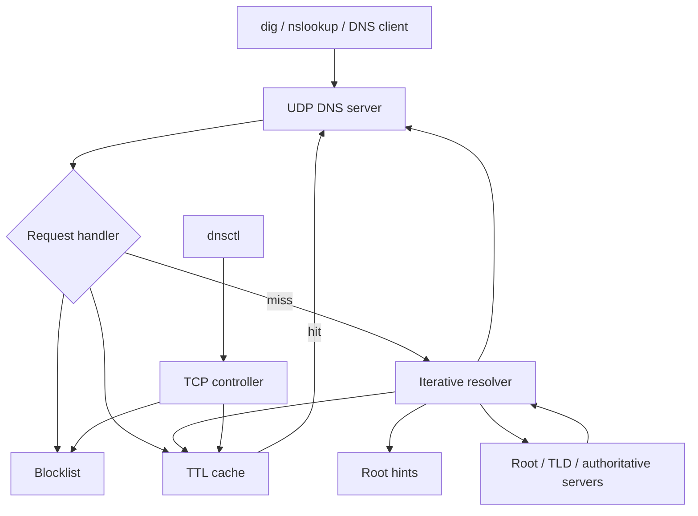

# Final Project Report: Local DNS Resolver

## 1. Introduction

For final project, we implemented a local DNS resolver and server in Go. The completed system can run as a local UDP DNS server and can be queried with standard tools such as `dig` and `nslookup`. It performs iterative resolution from built-in root hints, stores resolved records in an in-memory TTL cache, supports runtime domain blocking, and includes a lightweight controller client for inspecting and modifying server state while it is running. The implementation is intended as a practical local resolver and demonstration system rather than a production-grade replacement for a full DNS resolver.

## 2. Implementation

The project has two command programs under `cmd/`. The server starts in `cmd/dns_server/main.go`. This file handles command-line flags for the DNS port, controller port and log level. It creates the logger and root context, constructs the DNS server with `dns.NewDNSServer`, starts the UDP DNS listeners, and starts the controller service.

Most of the DNS server logic is in `internal/server/dns/server.go`. The main `Server` type stores the UDP sockets, internal queues, blocklist, cache, and resolver timing state. The server listens on both IPv4 and IPv6. When a UDP packet arrives, `readFromConn` reads the bytes, parses the packet into a DNS message using `dns.Msg.Unpack`, and sends the parsed request into an internal receive queue.

The request path is straightforward. The server first checks that the DNS message has a question. Then it checks the blocklist. If the name is blocked, the server immediately returns `NXDOMAIN`. If the name is not blocked, the server checks the cache. A cache hit can be answered directly. A cache miss starts the iterative resolver, and the server later builds a DNS response from the resolver's result.

We used `github.com/miekg/dns` for DNS message parsing and serialization. That library handles details such as unpacking DNS packets from bytes and packing response messages back into bytes. The resolver behavior itself is still implemented in our code: when to use the cache, when to send an outside query, how to follow referrals, and how to store records.



The iterative resolver is implemented in `internal/server/dns/resolver.go`. It starts from the root zone and follows DNS referrals until it reaches an answer for the original question. The resolver sends non-recursive UDP queries. First it asks a root server. The root server returns a referral to the right TLD. The resolver then asks a TLD server, which returns a referral to the authoritative server. Finally, the resolver asks an authoritative server and receives the answer records.

Root hints are stored in `internal/server/dns/roothints.go`. At startup, the server loads the thirteen root name server records and their A/AAAA addresses into the cache. These root hints are what let the resolver begin without asking another recursive DNS server for help.

Glue records were one of the more important parts of the implementation. A referral often gives the resolver an NS record, but the resolver still needs an IP address for that name server. If the DNS response includes A or AAAA records in the additional section, the resolver can use them as glue. If the glue is missing, the resolver performs a subquery to resolve the name server address. This made the resolver much closer to how real iterative resolution works.

The cache is implemented in `internal/server/dns/cache.go`. It stores records by domain name, record type, and class. Records are grouped into RR sets, and duplicate records are avoided by using the record data as a key. The cache also keeps TTL behavior. A background ticker decrements TTL values once per second and removes expired records. When the server answers from cache, it returns copies of cached records so response construction does not accidentally mutate the stored data.

The blocklist is implemented in `internal/server/blocklist/blocklist.go`. It supports exact matches, wildcard-style entries like `*.example.com`, and suffix-style entries like `.example.com`. Names are normalized to lowercase and the final DNS dot is stripped before matching. The blocklist check happens before cache lookup or resolver work, so blocked domains are answered quickly.

The controller code is split between `internal/server/interface/controller.go`, `internal/protocol/control.go`, and `cmd/dnsctl/main.go`. The server listens for controller connections over TCP. The `dnsctl` client provides a small prompt and sends commands to the running server. The implemented controller commands can block a domain, unblock a domain, list blocked domains, and list cached records. This was useful during demos because we could start the DNS server once, add a blocked domain at runtime, and immediately query the DNS server to see the result.

The server uses goroutines and channels in several places. UDP readers, request handling, response sending, resolver work, cache TTL countdowns, and the controller server all run concurrently. The cache and blocklist are shared data structures, so they use mutexes. This design kept the server responsive while it was waiting on outside DNS replies.

## 3. Discussion and Results

The server can be run locally on a high-numbered port so it does not need root privileges:

```text
./dns_server -port 1053 -controller-port 17878 -log debug
```

On startup, the server logs that it loaded root hints and started listening:

```text
level=INFO msg="Loaded root hints" module=dns-server
level=INFO msg="DNS server is running" dnsPort=1053 controllerPort=17878
```

A simple root query shows that the server can answer from its built-in root hints:

```text
$ dig @127.0.0.1 -p 1053 . NS +noall +answer +comments
status: NOERROR
ANSWER: 13
```

We also tested a normal external lookup through the local server:

```text
$ dig @127.0.0.1 -p 1053 example.net A +time=4 +tries=1 +noall +answer +comments
example.net. 300 IN A 104.20.21.8
example.net. 300 IN A 172.66.175.59
```

The server logs for this query showed the iterative path we wanted to demonstrate. The resolver contacted a root server, followed the referral into the `net.` zone, followed another referral toward `example.net.`, handled missing glue for the authoritative name server, and then received the final A records. This was one of the clearest signs that the project was doing real iterative resolution rather than forwarding the query to another recursive resolver.

The cache behavior is visible by repeating the same query. The first response for `example.net` had TTL 300, and a later response returned the same A records with a lower TTL:

```text
example.net. 292 IN A 104.20.21.8
example.net. 292 IN A 172.66.175.59
```

The controller can also list the cache. After the `example.net` query, the `lr` command shows an RRSet for `example.net.`, confirming that the answer was inserted into the server cache.

The blocklist demo uses `dnsctl` to block a domain while the server is already running:

```text
$ printf 'block example.com\nlb\nexit\n' | ./dnsctl -addr 127.0.0.1:17878
OK blocked example.com
OK example.com
```

After that, a DNS query for the blocked domain returns `NXDOMAIN`:

```text
$ dig @127.0.0.1 -p 1053 example.com A +noall +answer +comments
status: NXDOMAIN
ANSWER: 0
```

The server also works with `nslookup`, which helped confirm that it speaks normal DNS and not just a format that works for one command:

```text
$ nslookup -port=1053 example.net 127.0.0.1
Server: 127.0.0.1
Address: 127.0.0.1#1053

Non-authoritative answer:
Name: example.net
Address: 104.20.21.8
Name: example.net
Address: 172.66.175.59
```

The hardest part of the project was understanding the state needed for iterative resolution. It is not enough to send one packet and wait for one answer. The resolver has to remember which zone it is working on, which name servers it has tried, which glue records are available, and when it needs to make a subquery for a name server address. Handling referrals from root to TLD to authoritative servers took some time to get right.

TTL caching was another useful lesson. A DNS cache is not just a dictionary from name to IP address. Every record has a lifetime, and the server should return the remaining TTL rather than the original TTL forever. Implementing the countdown made the cache behavior visible in the demo.

We also got more comfortable with Go networking and concurrency. UDP code has fewer connection-management steps than TCP, but it still requires careful handling of packet buffers, deadlines, source addresses, and serialization errors. On top of that, the DNS server, resolver, cache timer, and controller all run concurrently. Using goroutines and channels worked well, but shared state such as the cache and blocklist still needed locks.

The controller made the project feel more complete. It gave us a way to interact with the running server instead of restarting it for every change. Keeping the controller small also helped us avoid overbuilding it.

## 4. AI Tools Experience

We used AI tools mainly to help us learn more about the DNS protocol and Go during the project. However, we still followed an old-school programming style: we wrote the code ourselves, tested it ourselves, and made sure we understood each part of the implementation. We did not directly copy and paste AI-generated code into the project.

## 5. Conclusions and Future Work

This project made DNS much less mysterious for us. We now have a better understanding of how a resolver starts from root hints, follows referrals, uses glue records, caches answers, and responds to normal DNS clients. We also got more practice writing Go programs that use UDP sockets, goroutines, channels, timers, and mutex-protected shared state.

The project was satisfying because it turned a protocol we use every day into something we could run and inspect locally. Seeing `dig` and `nslookup` talk to our own server was the best part of the project, and the blocklist/controller demo made the server feel interactive.

If we continued working on the project, the next steps would follow the future features already noted in the code. One improvement would be DNSSEC support, so the resolver could handle DNSSEC-related records instead of ignoring them. Another improvement would be custom local-network records, so the server could answer selected internal names directly before falling back to iterative resolution.
